# NOT T3 Chat (Clone)

A modern AI chat application built with Next.js, Prisma, NextAuth supporting multiple AI providers including OpenAI, Anthropic, Google, and more.

## ✨ Features

- 🤖 Multiple AI provider support (OpenAI, Anthropic, Google, DeepSeek, Xai, OpenRouter, and more)
- 🌐 Grounding/web search for Google models and OpenAI that allow it.
- 🖼️ Image generation with OpenAI models with follow ups (
  "gpt-4o-mini",
  "gpt-4o",
  "gpt-4.1",
  "gpt-4.1-mini",
  "gpt-4.1-nano",
  "o3",
  )
- 🔄 Multi-concurrent conversations support
- 🔐 Authentication with NextAuth
- 🔑 JWT token-based authentication
- 🛡️ API Key Encryption for secure storage
- 👤 User management and profiles
- 💾 Persistent chat history with Prisma
- 📤 History Sync Export/Import functionality
- 📌 Pin important conversations for quick access
- 🔗 Chat sharing - share conversations with others via secure links
- 🧠 Reasoning/thinking mode support
- 🎨 Modern UI with Tailwind CSS and Radix UI
- 🌙 Dark/Light mode support
- ⚡ Real-time streaming responses
- 📱 Responsive design
- 🔧 Customizable user settings and prompts
- 🎯 Syntax highlighting for code blocks
- 🌳 Conversation branching support
- 🔄 Retry responses with same or different models
- 🌊 Stream resuming with backend caching (SQLite locally, Redis in production)
- 🐛 Streamlined Bug reporting
- 💾 Blob/local storage support for prod/local deployments

## 📸 Screenshots

### Authentication & Registration

<table>
  <tr>
    <td align="center">
      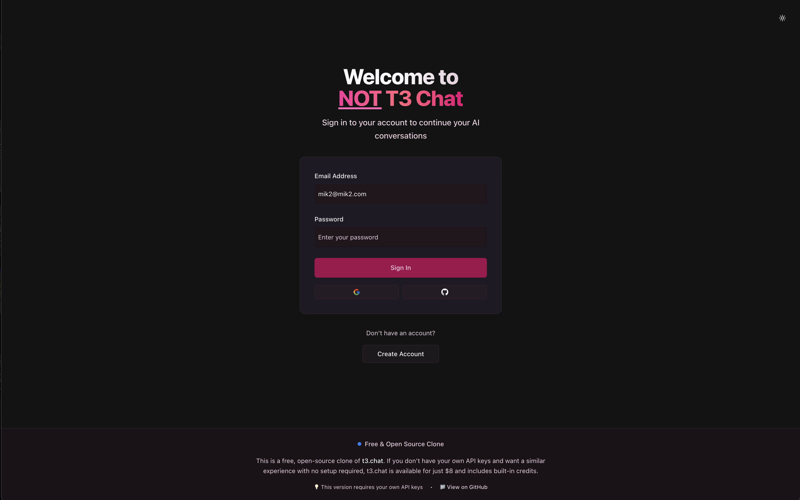
      <br/><strong>Sign In</strong>
    </td>
    <td align="center">
      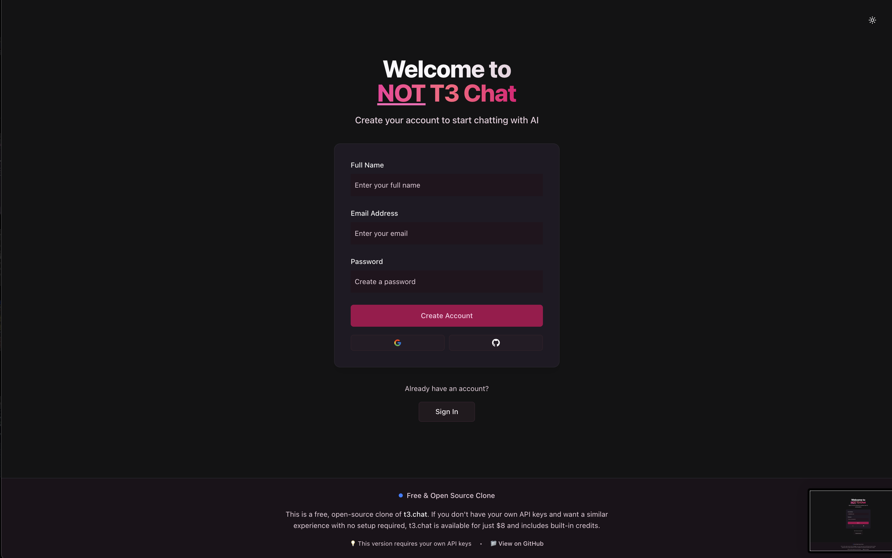
      <br/><strong>Register</strong>
    </td>
  </tr>
</table>

### Chat Interface

<table>
  <tr>
    <td align="center">
      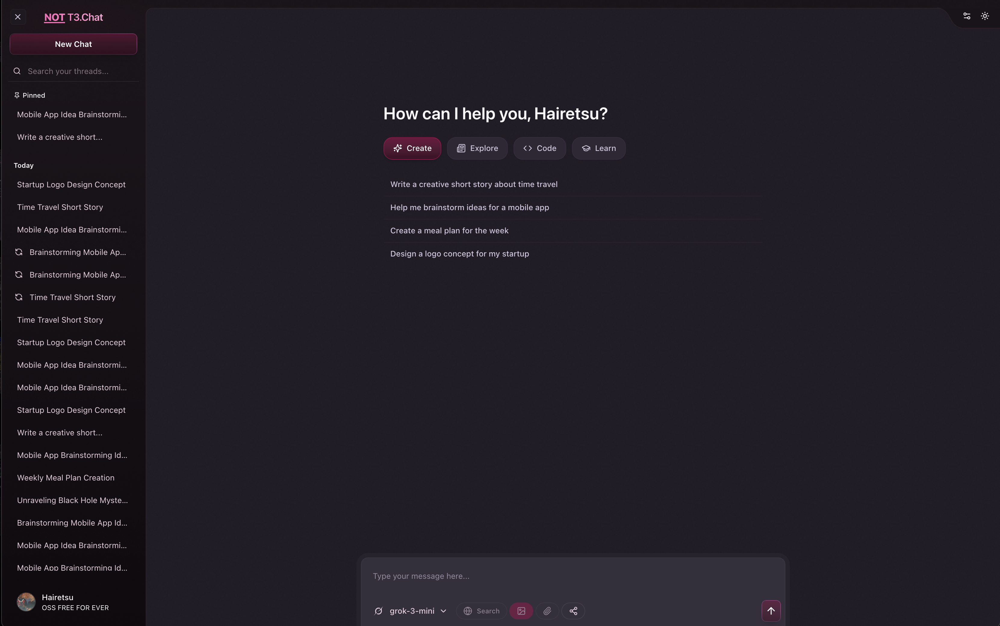
      <br/><strong>Main Chat Interface</strong>
    </td>
  </tr>
  <tr>
    <td align="center">
      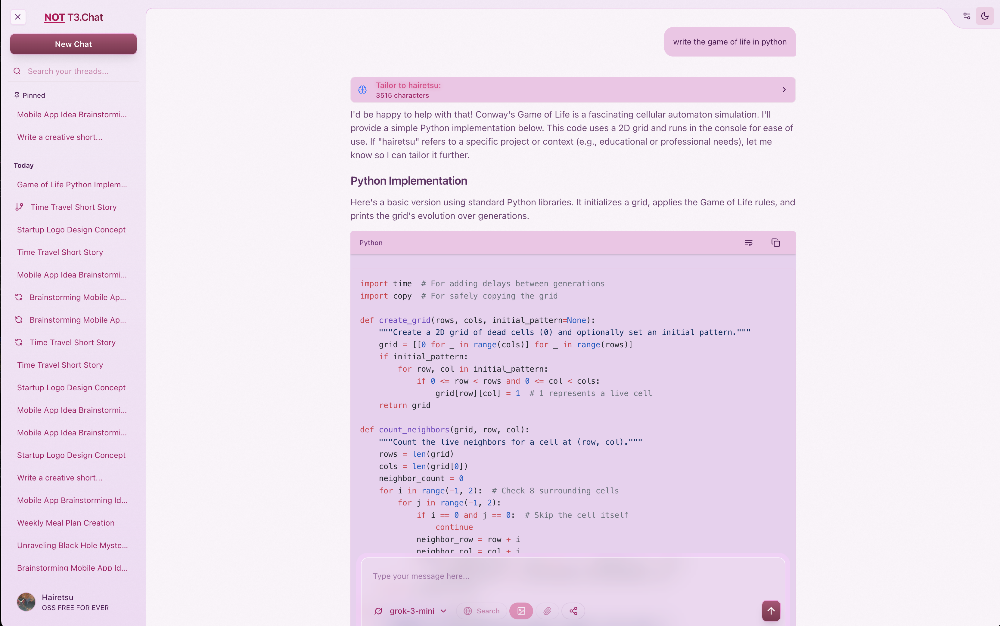
      <br/><strong>Light Mode Interface</strong>
    </td>
  </tr>
  <tr>
    <td align="center">
      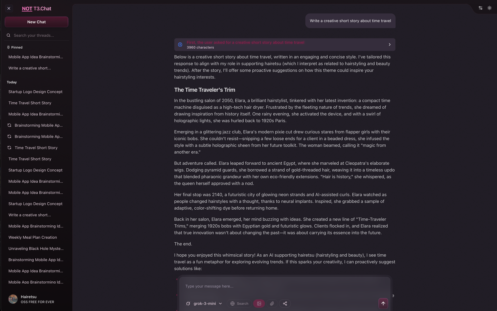
      <br/><strong>Reasoning/Thinking Mode</strong>
    </td>
  </tr>
  <tr>
    <td align="center">
      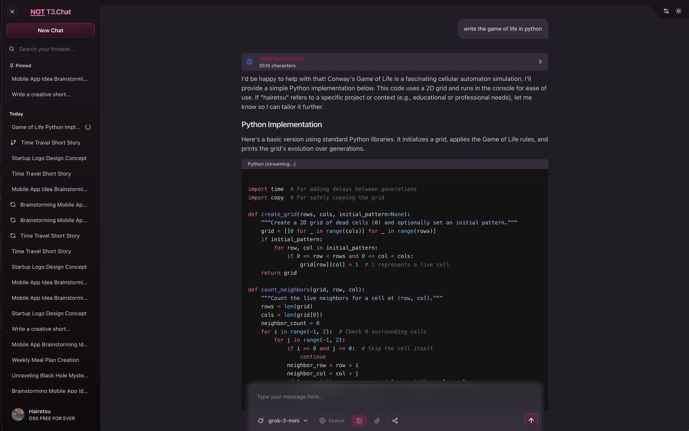
      <br/><strong>Code Reasoning Mode</strong>
    </td>
  </tr>
 
</table>

### Configuration & Settings

<table>
  <tr>
    <td align="center">
      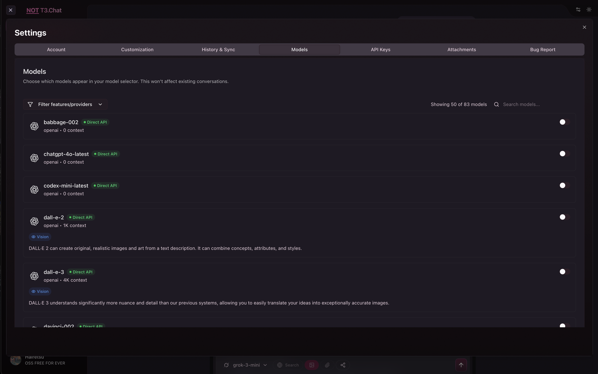
      <br/><strong>AI Model Selection</strong>
    </td>
    <td align="center">
      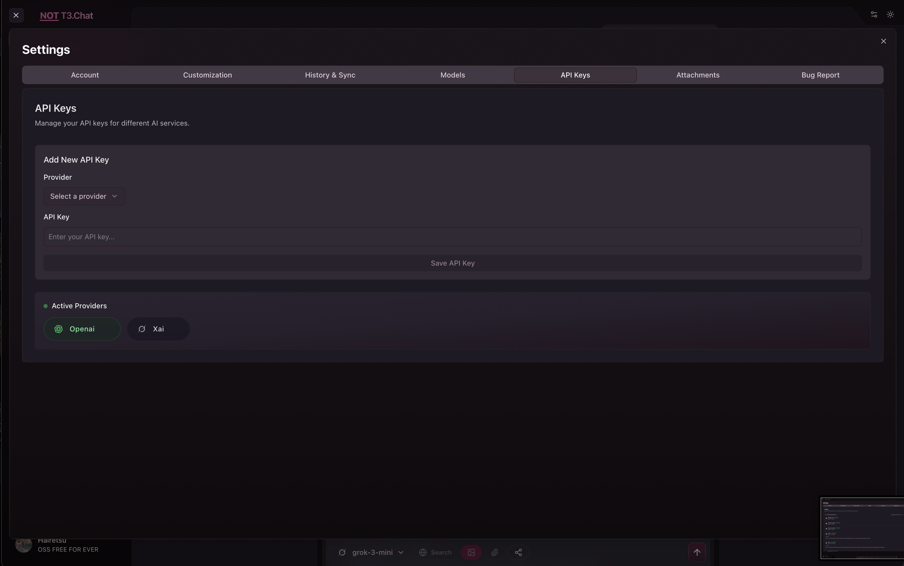
      <br/><strong>API Key Management</strong>
    </td>
  </tr>
  <tr>
    <td align="center">
      
      <br/><strong>User Customization</strong>
    </td>
    <td align="center">
      
      <br/><strong>Account Settings</strong>
    </td>
  </tr>
</table>

### Additional Features

<table>
  <tr>
    <td align="center">
      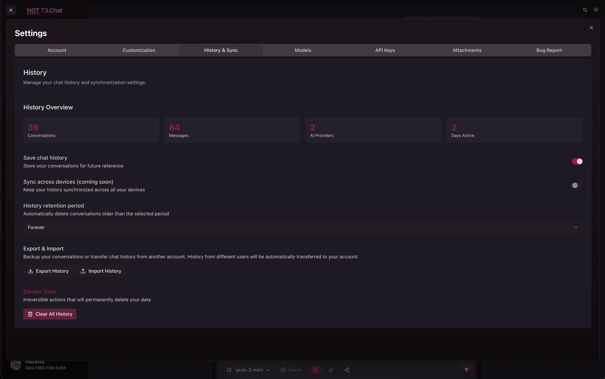
      <br/><strong>Chat History Management</strong>
    </td>
    <td align="center">
      
      <br/><strong>Bug Report System</strong>
    </td>
  </tr>
  <tr>
    <td align="center">
      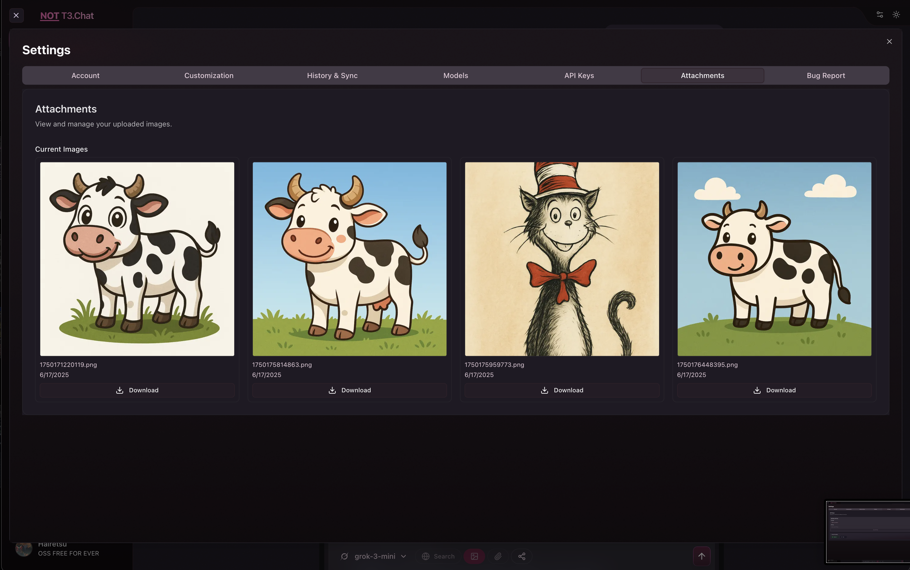
      <br/><strong>File Attachments</strong>
    </td>
    <td align="center">
      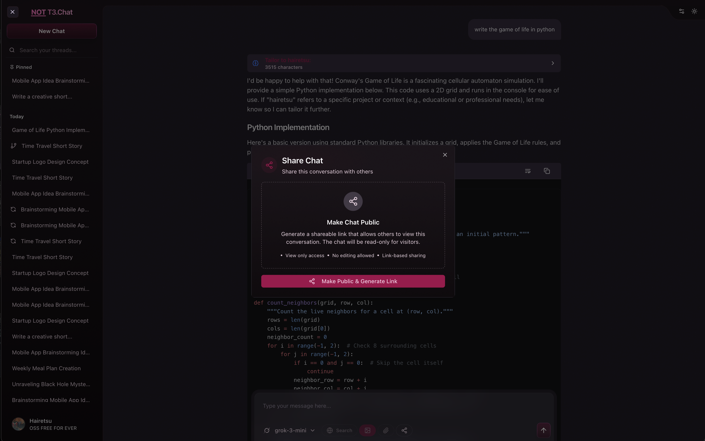
      <br/><strong>Chat Sharing</strong>
    </td>
  </tr>
</table>

## 🚀 Development Setup

### Prerequisites

- Node.js 18+
- pnpm (recommended) or npm
- Git
- OpenSSL

### Installation

1. **Clone the repository:**

   ```bash
   git clone <repository-url>
   cd oss-t3-chat
   ```

2. **Install dependencies:**

   ```bash
   pnpm install
   ```

3. **Initial Setup (setup local .env, create & push schema, generate salt/secret)**

   ```bash
   pnpm run setup
   ```

4. **Generate API Key Salt:**

   ```bash
   openssl rand -hex 32
   ```

   Or use Node.js:

   ```bash
   node -e "console.log(require('crypto').randomBytes(32).toString('hex'))"
   ```

   > **Note**: The `API_KEY_SALT` is used to securely encrypt API keys stored in your database. Keep this value secret and consistent across deployments.

5. **Start the development server:**
   ```bash
   pnpm dev
   ```

Visit [http://localhost:3000](http://localhost:3000) to see the application.

> **Note**: Always run `pnpm run setup` before `pnpm dev` or `pnpm build` to ensure the database is properly initialized.

## 🏭 Production Build & Start

### Production Environment Setup

1. **Set up production environment variables:**

   ```bash
   cp .env.example .env
   ```

2. **Configure your production `.env` file:**

   ```env
   # Database (use PostgreSQL for production if preferred)
   DATABASE_URL="mysql:/

   # NextAuth
   AUTH_SECRET="your-secure-production-secret"
   API_KEY_SALT="your-secure-api-key-salt"
   NEXTAUTH_URL="https://your-domain.com"

   ```

3. **For database migrations in production:**
   ```bash
   pnpm db:migrate
   ```

### Quick Production Setup

1. **Ensure database is initialized:**

   ```bash
   pnpm run setup
   ```

2. **Build the application:**

   ```bash
   pnpm build
   ```

3. **Start the production server:**
   ```bash
   pnpm start
   ```

The application will be available at [http://localhost:3000](http://localhost:3000).

### Production Checklist

- ✅ Environment variables configured
- ✅ MSSQL Database properly migrated
- ✅ AUTH_SECRET is secure and unique
- ✅ API_KEY_SALT is secure and unique
- ✅ NEXTAUTH_URL matches your domain
- ✅ Application built successfully (`pnpm build`)

### Available Scripts

#### Development

- `pnpm dev` - Start development server with Turbopack
- `pnpm build` - Build for production
- `pnpm start` - Start production server
- `pnpm lint` - Run ESLint

#### Database Management

- `pnpm run setup` - **Quick setup** (creates, generates + push schema to db)
- `pnpm db:generate` - Generate Prisma client
- `pnpm db:push` - Push schema to database (development)
- `pnpm db:migrate` - Create and apply migrations (production)
- `pnpm db:studio` - Open Prisma Studio
- `pnpm db:reset` - Reset database (⚠️ destroys data)
- `pnpm db:seed` - Seed the database

### Database Setup

This project uses SQLite for local development and Prisma as the ORM.

#### First-time Setup

```bash
pnpm run setup
```

#### Schema Changes

After modifying `prisma/schema.prisma`:

```bash
pnpm db:generate
pnpm db:push
```

#### Database Management

Open Prisma Studio to manage your data:

```bash
pnpm db:studio
```

## 🐳 Docker Deployment

The easiest way to deploy the application is using Docker:

### Using Docker Compose (Recommended)

1. **Build and run with Docker Compose:**

   ```bash
   docker-compose up --build
   ```

2. **Run in detached mode:**

   ```bash
   docker-compose up -d --build
   ```

3. **Stop the application:**
   ```bash
   docker-compose down
   ```

The Docker setup includes:

- Automatic database initialization
- Persistent data storage in `./docker-data` directory
- Auto-generated `AUTH_SECRET` and `API_KEY_SALT` if not provided
- Proper SQLite database handling for containers

### Using Docker directly

1. **Build the image:**

   ```bash
   docker build -t oss-t3-chat .
   ```

2. **Run the container:**
   ```bash
   docker run -p 3000:3000 \
     -v $(pwd)/docker-data:/app/data \
     -e NEXTAUTH_URL=http://localhost:3000 \
     oss-t3-chat
   ```

### Environment Variables for Docker

Create a `.env.docker` file for custom configuration:

```env
# Database (automatically configured for container)
DATABASE_URL="file:/app/data/prod.db"

# NextAuth (auto-generated if not provided)
AUTH_SECRET="your-generated-secret-here"
API_KEY_SALT="your-generated-api-key-salt"
NEXTAUTH_URL="http://localhost:3000"

```

Then use it with docker-compose:

```bash
# Uncomment env_file in docker-compose.yml
docker-compose --env-file .env.docker up --build
```

## 🔧 Configuration

### Environment Variables

Create a `.env` file with the following variables:

```env
# Database
DATABASE_URL="file:./dev.db"

# NextAuth
AUTH_SECRET="your-nextauth-secret"
API_KEY_SALT="your-api-key-salt"  # Used for encrypting API keys in database
NEXTAUTH_URL="http://localhost:3000"
```

### AI Provider Setup

The application supports multiple AI providers. Configure the API keys for the providers you want to use:

- **OpenAI**: GPT models (gpt-4o, gpt-4o-mini, gpt-3.5-turbo, etc.)
- **Anthropic**: Claude models (claude-3.5-sonnet, claude-3-opus, claude-3-haiku, etc.)
- **Google**: Gemini models (gemini-pro, gemini-1.5-pro, etc.) with support for grounding/web search
- **DeepSeek**: DeepSeek models (deepseek-chat, deepseek-coder, etc.)
- **Xai**: Grok models (grok-beta, etc.)
- **OpenRouter**: Access to hundreds of models through one unified API including many open-source options

### Conversation Features

#### Branching

The application supports conversation branching, allowing users to:

- Create alternative conversation paths from any message
- Explore different responses while preserving the original thread
- Switch between branches seamlessly
- Compare different conversation trajectories

#### Retry Functionality

Users can retry any AI response with:

- The same model for different variations
- A different model to compare responses
- Modified parameters (temperature, tokens, etc.)
- Preserved context from the original conversation

## 🏗️ Project Structure

```
├── ai/                # AI provider configurations and utilities
├── app/               # Next.js 15+ app directory
│   ├── api/           # API routes
│   ├── chat/          # Chat pages
│   └── ...
├── components/        # React components
├── context/           # React context providers
├── data/              # Database operations and queries
├── docker-data/       # Docker persistent data storage
├── hooks/             # Custom React hooks
├── lib/               # Utility libraries and configurations
├── prisma/            # Database schema and migrations
├── public/            # Static assets and images
│   └── images/        # UI assets and preview screenshots
│       ├── noise.png  # Background texture/visual effect
│       └── previews/  # Application screenshots
├── schemas/           # Validation schemas (Zod, etc.)
├── scripts/           # utility scripts
└── types/             # TypeScript type definitions
```

## 🚀 Production Deployment

### Build for Production

```bash
pnpm build
```

### Environment Setup for Production

Ensure all environment variables are properly configured for your production environment, especially:

- `DATABASE_URL` (consider PostgreSQL for production)
- `AUTH_SECRET` (use a secure random string)
- `API_KEY_SALT` (use a secure random string for API key encryption)
- `NEXTAUTH_URL` (your production domain)

### Database Migration for Production

```bash
pnpm db:migrate
```

## 🤝 Contributing

1. Fork the repository
2. Create a feature branch: `git checkout -b feature/amazing-feature`
3. Install dependencies: `pnpm install`
4. Set up the database: `pnpm run setup`
5. Make your changes
6. Run tests: `pnpm lint`
7. Commit your changes: `git commit -m 'Add amazing feature'`
8. Push to the branch: `git push origin feature/amazing-feature`
9. Open a Pull Request

## 📚 Tech Stack

- **Framework**: Next.js 15 with App Router
- **Database**: Prisma ORM with SQLite (dev) / MSSQL (prod)
- **Authentication**: NextAuth.js
- **Styling**: Tailwind CSS + Radix UI
- **AI Integration**: Multiple providers via AI SDK
- **Type Safety**: TypeScript
- **Package Manager**: pnpm

## 🐛 Troubleshooting

### Common Issues

1. **Module not found errors**: Run `pnpm db:generate` to ensure Prisma client is generated
2. **Database connection issues**: Check your `DATABASE_URL` in `.env`
3. **Build failures**: Ensure all environment variables are set
4. **Authentication issues**: Verify `AUTH_SECRET` and `NEXTAUTH_URL`

### Getting Help

- Check the [Issues](https://github.com/your-repo/issues) page
- Review the [Discussions](https://github.com/your-repo/discussions) section
- Consult the documentation for [Next.js](https://nextjs.org/docs), [Prisma](https://prisma.io/docs), and [NextAuth](https://next-auth.js.org/)

### TODO in no particular order

- Image Analysis (pending)
- Attachments
- Optimize DB querying
- Refactor x100
- Ollama Local
- Extra Credit: Voice 2 Voice over websockets.

## 📄 License

This project is licensed under the Apache 2.0 License - see the [LICENSE](LICENSE) file for details.
